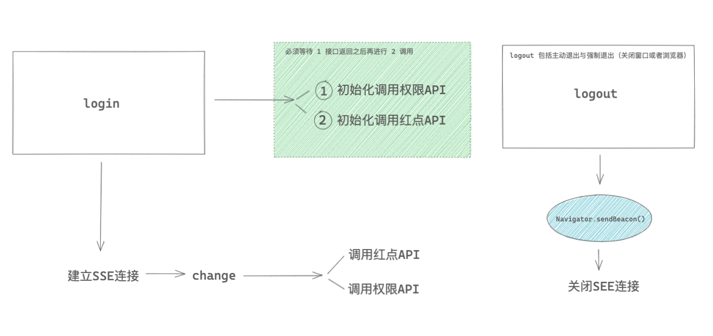

# SSE
> SSE 全称是 Server-Sent Events，用于服务端推送到客户端的一种手段，有很多 WebSocket vs SSE的文章，大家可以去看看。最终根据自己的业务需求，或后期的产品规划进行抉择。我们这边纯粹是为了，服务端进行推送，前端展示一个数量，没有其他的交互。所以最终还是采用了 SSE 的方案。

## 前期的调研
我们在前期进行了 SSE 技术调研，发现案例数量相对 WebSocket，还是有一定的差距的。
如果你打算使用 SSE，请三思而后行，除非业务方愿意给你时间去进行调研工作，且能承担推翻重来的风险。

### 下图是我们准备实现的流程

