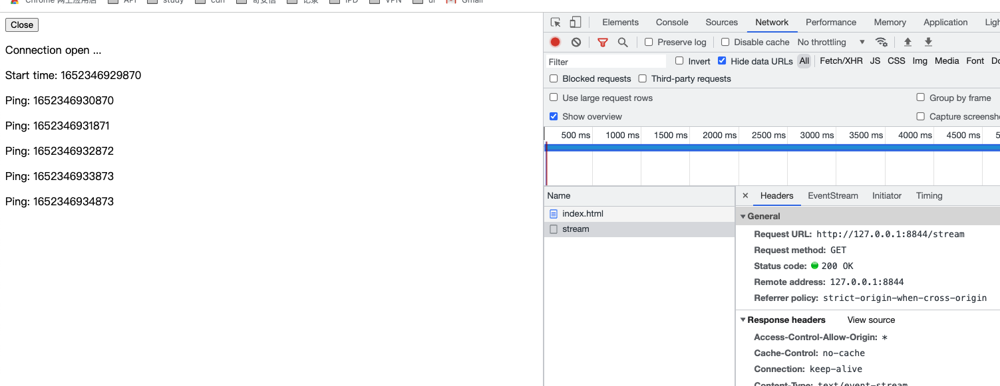

# SSE
> `SSE` 全称是 `Server-Sent Events`，用于服务端推送到客户端的一种手段，有很多 `WebSocket` vs `SSE`的文章，大家可以去看看。最终根据自己的业务需求，或后期的产品规划进行抉择。我们这边纯粹是为了，服务端进行推送，前端展示一个数量，没有其他的交互。所以最终还是采用了 `SSE` 的方案。

## 前期的调研
我们在前期进行了 `SSE` 技术调研，发现案例数量相对 `WebSocket`，还是有一定的差距的。但是 SSE 前端需要处理的事情并不多，只需要关注几个动作
- open
- change
- close

因为 SSE 就像是观察者模式，有 change 才触发。

阮一峰老师的 [Server-Sent Events 教程](http://www.ruanyifeng.com/blog/2017/05/server-sent_events.html) 文档清晰明了


我们团队计划从登录之后开始打开连接，并且初始化权限，再进行调用初始化

需要值得注意的地方是 强制关闭浏览器，或者直接关闭 Tab，会导致你的 `Close` 还未发送成功就关闭了进程。可以使用 [MDN Navigator.sendBeacon](https://developer.mozilla.org/zh-CN/docs/Web/API/Navigator/sendBeacon) 来进行 close。


## Demo
我们直接来看 Demo（由 `Nodejs` 与 `JavaScript` 做的）

**Nodejs**

创建 `index.js` 文件

```js
var http = require("http");

http.createServer(function (req, res) {
  var fileName = "." + req.url;

  if (fileName === "./stream") {
    res.writeHead(200, {
      "Content-Type":"text/event-stream",
      "Cache-Control":"no-cache",
      "Connection":"keep-alive",
      "Access-Control-Allow-Origin": '*',
    });
    res.write("retry: 10000\n");
    res.write("event: connecttime\n");
    interval = setInterval(function () {
      res.write("data: " + (new Date()).getTime() + "\n\n");
    }, 1000);

    req.connection.addListener("close", function () {
      console.log("close");
      clearInterval(interval);
    }, false);
  }
}).listen(8844, "127.0.0.1");
```

启动服务

```shell
node index.js
```

**JavaScript**

创建一个 `index.html`

```html
<button onclick="closeSource()"> Close </button>
<div id="example"></div>
<script>
  var source = new EventSource('http://127.0.0.1:8844/stream');
  var div = document.getElementById('example');
  
  source.onopen = function (event) {
    div.innerHTML += '<p>Connection open ...</p>';
  };
  
  source.onerror = function (event) {
    div.innerHTML += '<p>Connection close.</p>';
  };
  
  source.addEventListener('connecttime', function (event) {
    div.innerHTML += ('<p>Start time: ' + event.data + '</p>');
  }, false);
  
  source.onmessage = function (event) {
    div.innerHTML += ('<p>Ping: ' + event.data + '</p>');
  };

  const closeSource = () => {
    source.close();
    console.log("close");
  }
</script>
```

在浏览器中我们就能看到下面的效果

